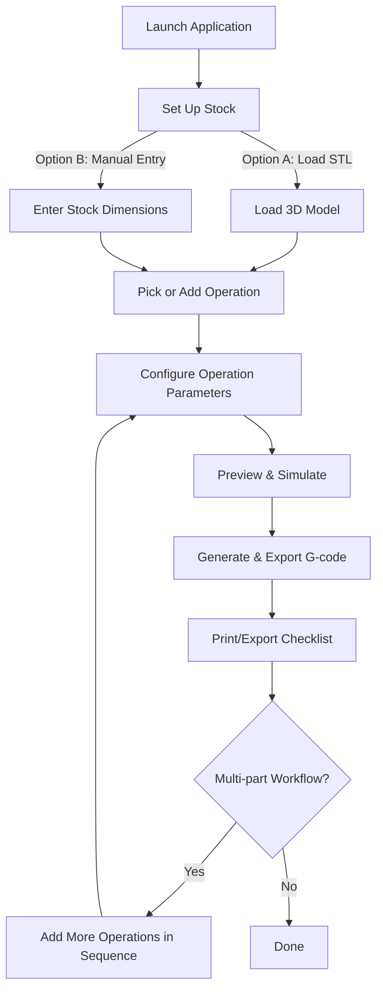

# Project Roadmap & TODO

## Issues
- [x] Green material for stock is unappealing and doesn't pop out enough. The object stock material looks much better, but we need to be able to tell them apart.
- [ ] Material is removed discretely along toolpath, and not continuosly, making it look as if the tool is set down at individual points along the path instead of dragged along the path
- [x] Tools cut past mesh
- [x] When calculating toolpath, the shape of the tool needs to be considered against the shape of the patch it is trimming
- [ ] Some terminology is confusing, need inline help with question mark icons or similar to enable crisp explanations 
- [x] Bounding box doesn't show after the STL is loaded, it only shows after simulation is run

## Tool Definition and Stock Simulation

- [x] Minimal tool definition (object with diameter and type, e.g. flat)
  - [x] Add tool data structure (e.g. { diameter: number, type: 'flat' })
  - [x] UI for selecting tool diameter and type (flat only at first)
  - [x] Visualize the tool live

- [ ] Stock simulation (material removal)
  - [x] Decide on initial heightmap-based simulation for 2.5D
  - [x] Implement stock_heightmap data structure and update logic
  - [x] Simulate material removal for flat endmill using heightmap
  - [x] Adopt STL (natural) coordinates for all simulation and toolpath operations.
  - [x] Remove any translation of toolpath or stock to (0,0,0).
  - [ ] Selectable which way is down (+/- x, y or z) since not all STL have the same orientation
  - [x] Stock should update when tool is updated (consider adding a "generate" button to trigger update)
  - [ ] Allow user to specify stock offset/extra material in STL coordinates.
  - [x] Visualize updated stock after each toolpath segment (in progress)
  - [ ] Add unit tests for stock update logic
  - [ ] Design abstraction layer for stock representation (heightmap or mesh)
  - [ ] Plan and prototype mesh-based stock simulation for full 3D/4th axis
  - [ ] Allow switching between heightmap and mesh simulation modes

- [ ] Extend tool definition for more shapes (ball, V-bit, etc.) after flat tool works
  - [x] support ball-nose
  - [x] support V-bit
  - [ ] support tapered ball

## Features
- [ ] G-code export for toolpaths
  - [x] Basic G-code generation from toolpath
  - [x] UI button to export/download G-code file
  - [ ] User-settable feedrate, safe Z, and units
  - [x] Raster tool needs to left to safe depth and use go command before starting next scan line. Currently, the tool head is travelling through the material
  - [ ] G-code preview in UI
  - [ ] Support for multiple toolpaths/operations
  - [x] Test with real-world toolpaths and G-code viewers

- [ ] Path generation strategies
  - [x] Raster strategy: endmill moves back and forth across the entire workpiece, changing its depth per the heightmap
  - [ ] Contour strategy: endmill follows contour lines, typically starting at the maximum distance from the contour line
  - [ ] Multi-pass - clearing and refining

- [ ] Path generation options
  - [ ] Maximum depth of cut
  - [ ] Direction of travel
  - [ ] Climb (down) or conventional (up) milling (see https://www.madearia.com/blog/climb-vs-conventional-milling/)

- [x] Tool definition (at minimum: diameter, type/shape)
  - [x] UI for selecting tool type and diameter
  - [x] Use tool definition in toolpath and simulation

- [x] Stock simulation (visualize material removal as toolpaths are executed)
  - [x] Use tool shape for material removal
  - [ ] Stock can be defined with an stl file - useful for machining existing parts

- [x] Tool shape selection (flat, ball, V-bit, etc.)
- [x] Tool visualization in 3D view
- [ ] Adaptive paths to minimize errors - e.g., clearing uses large steps, and vertical and horizontal plans and step sizes adjust to geometry and tool

## Workflows
- [x] Start from 3D model (STL)
- [ ] Start from heightmap (bitmap)
- [ ] Start from Vector
    - [ ] Carve uses outlines of the vector
    - [ ] Pocket uses filled vector shapes to define pockets
- [ ] Code-based paths for generating patterns, fractals, and spirograph-like designs
- [x] Flatten operation - Flatten surface based on tool, feed rate, depth of cut
- [ ] Multi part workflows - ex: Zero, Flatten, Manually change the bit, Mill the Top, Manually Rotate Stock, Mill 2nd face, etc.

## Tool library
- [ ] You can define the endmills that you own, and pick them from a list for operations

## Operation Creation Workflow (Mermaid Diagram)

## Flatten Operation Workflow

- [x] **Flatten operation** (first-class workflow step)
  - [x] User can select "Flatten" as an operation (standalone or as first step in multi-part jobs)
  - [x] User sets flatten depth (single pass for now)
  - [x] User sets tool, step-over, etc.
  - [x] App generates raster toolpath at constant Z for flattening
  - [x] Simulate result: update stock heightmap to new flat surface
  - [x] Export G-code for flatten operation
  - [ ] Area selection (entire top or X/Y min/max region)
  - [ ] Multi-pass flattening (if depth > tool's max cut)
  - [ ] After flatten, new "top" is reference for subsequent ops
  - [ ] Integrate with multi-part workflow (flatten, flip, mill, etc.)
  - [ ] Flatten works with or without STL loaded (user can set stock or flatten area manually)
  - [ ] Flatten toolpath extends beyond edges of material to avoid edge artifacts

## Multi-Part Workflow (Planned)

- [ ] Multi-part jobs are supported as a sequence of operations (flatten, mill, flip, etc.)
- [ ] Each operation generates its own G-code file (e.g., step1_flatten.nc, step2_top.nc, step3_flip.nc, ...)
- [ ] All G-code files can be written to an SD card for use on the CNC
- [ ] App generates a printable checklist for the workflow, e.g.:
  1. Load stock
  2. Zero to top of stock
  3. Execute step 1 (flatten) G-code
  4. Turn stock over
  5. Zero to new face
  6. Execute step 2 (top) G-code
  7. ...etc.
- [ ] Checklist includes user instructions for each step (tool changes, flips, zeroing, etc.)
- [ ] User can print or save the checklist for shop use
- [ ] Can simulate steps in the UI

## Operation Creation Workflow

1. Launch the application; workspace and control panel are visible.
2. Set up stock:
   - Option A: Load an STL file (for 3D model jobs).
   - Option B: Manually enter stock dimensions (width, height, thickness) if no STL is loaded, for flattening or facing.
3. Pick or add an operation:
   - User sees a list of available operations (Flatten, Carve, Drill, Flip, etc.).
   - Click “Add Operation” and select the type; operation is added to a sequence (can reorder/remove).
4. Configure operation parameters:
   - For the selected operation, set parameters (area, depth, tool, feedrate, etc.).
   - UI shows only relevant fields for the chosen operation.
5. Preview & simulate:
   - Preview toolpath and simulated result for the operation.
   - Toggle visibility of each operation’s result.
6. Generate & export G-code:
   - Generate G-code for each operation; export individually or as a set for SD card.
7. Print/export checklist:
   - App generates a printable checklist for the workflow (step-by-step shop instructions).
8. (Optional) Multi-part workflow:
   - Add multiple operations in sequence; each updates the stock state for the next.

## UX / UI
- [x] Group controls (file input, export, settings) in a unified panel or toolbar
  - [x] Implement vertical panel with sections: File, Export, Settings, Visibility
  - [x] Add section headers and visual separation
  - [ ] Prepare for future collapsible/expandable sections
- [ ] Toggle visibility of mesh, toolpath, and bounding box/object
- [ ] Orientation cube to quickly set views - right, top, etc.
- [ ] Add G-code preview panel or modal
- [ ] Add visualization for stock and keepout zones (clamps, bed, fixtures)
- [ ] UI for managing and displaying keepout/fixture items

## Ideas / Wishlist
- [ ] Playback/scrub through toolpath simulation
- [ ] Save/load project state

## Contour Carving
- [ ] Implement contour strategy for toolpath generation
  - [ ] Extract contours from heightmap using marching squares at regular Z intervals
  - [ ] (Optional) Extract contours from mesh using mesh slicing for full 3D
  - [ ] Offset contours by tool geometry (flat, ball, V-bit, etc.) at each Z
  - [ ] Use 2D polygon offsetting (Minkowski sum) for flat and ball tools
  - [ ] Compute effective tool radius at each Z for V-bit and tapered tools
  - [ ] Order contours for efficient machining (outer to inner or vice versa)
  - [ ] Generate G-code/toolpath for each contour
  - [ ] Visualize and simulate contour toolpaths
  - [ ] Add UI options for contour step size, tool selection, and cut direction
  - [ ] Research/choose libraries for marching squares and 2D offsetting (e.g., clipper.js)
  - [ ] Document assumptions and edge cases (e.g., overhangs, islands, holes)
